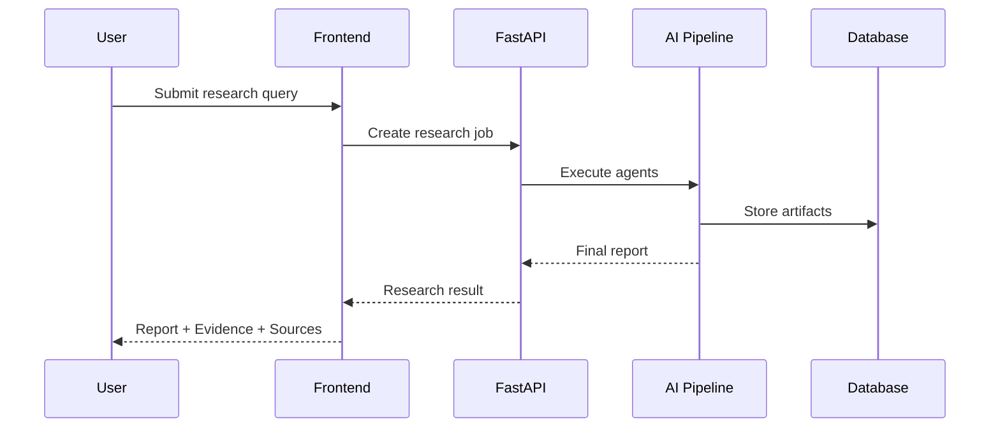

# Architecture
### How Meridian AI Research Engine is structured

## Design Principles
1. **Traceability first** — every important finding should connect back to evidence and sources.
2. **Specialized agents** — each stage has a focused responsibility.
3. **Structured outputs** — agents exchange predictable schemas.
4. **Fail fast** — weak or empty stage outputs are detected early.
5. **Independent deployment** — frontend and backend communicate through APIs.

## System Layers
| Layer | Responsibility |
|---|---|
| Frontend | Research input, dashboard, pipeline visualization, report viewer |
| Backend | API, orchestration, agent execution, business logic |
| Data Layer | Jobs, sources, evidence, validations, reports |

## Multi-Agent Pipeline

## End-to-End Data Flow

## Agent Responsibilities
- **Planning:** Converts a broad question into research tasks.
- **Research:** Discovers relevant and credible sources.
- **Extraction:** Extracts structured evidence from source material.
- **Validation:** Evaluates evidence quality and confidence.
- **Citation:** Maps claims to supporting sources.
- **Report:** Synthesizes findings into a structured report.
- **Linking:** Connects report claims with evidence for traceability.

## State Management
Persistent state should include research jobs, tasks, sources, evidence, validation results, citations, and reports. Temporary execution state should remain inside the pipeline runtime unless progress persistence is explicitly required.
